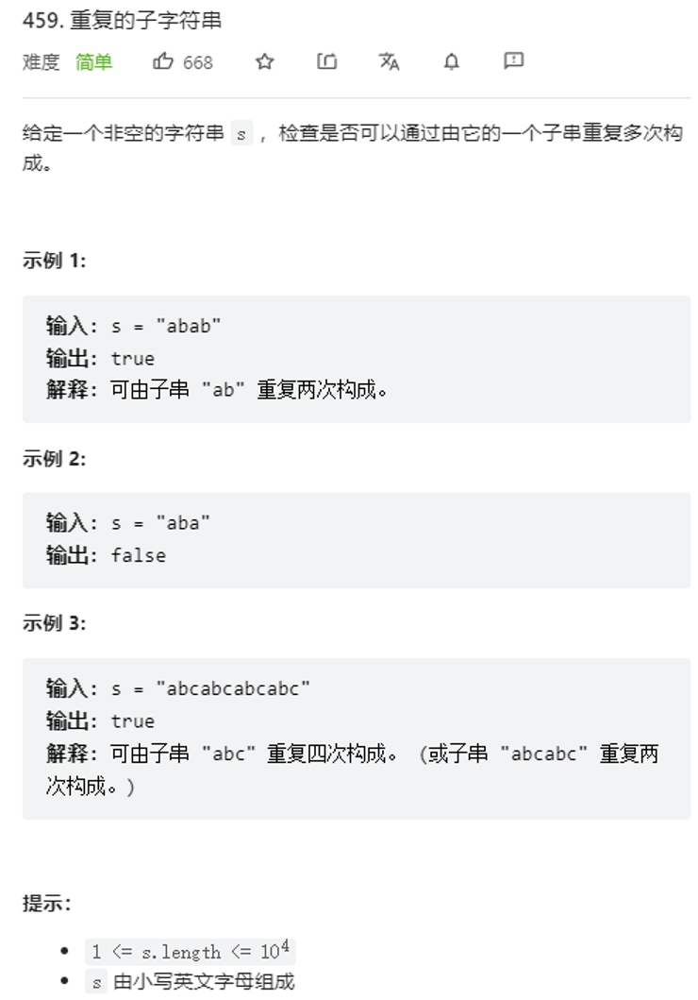

# 类型一：字符串匹配
直接用 kmp 进行字符串匹配
```cpp
class Solution {
public:
    int kmp(string t, string s) {
        if (t == "" || s == "") return 0; // 处理特殊情况
        getNext(s);
        int i = 0, j = 0;
        for (; i < t.size() && j < s.size(); i++, j++) {
            while (j != -1 && t[i] != s[j]) j = next[j];
        }
        return j == s.size() ? (i - j) : -1;
    }

private:
    void getNext(string& s) {
        if (s == "") return; // 处理空字符串
        next.assign(s.size(), 0);
        int k = -1, j = 0;
        next[0] = -1;
        while (j < s.size() - 1) {
            if (k == -1 || s[k] == s[j]) {
                k++, j++;
                next[j] = (s[j] == s[k]) ? next[k] : k;
            } else {
                k = next[k];
            }
        }
    }
    
    vector<int> next;
};
```
# 类型二：循环节
https://leetcode-cn.com/problems/repeated-substring-pattern/

```cpp
// 求最小循环节
class Solution {
public:
    bool repeatedSubstringPattern(string s) {
        vector<int> next(s.size() + 1, -1);
        int k = -1, j = 0;
        while (j < s.size()) { // 需要计算出 next[s.size()] 的值
            if (k == -1 || s[k] == s[j]) {
                next[++j] = ++k;
            } else {
                k = next[k];
            }
        }
        // 注意需要特判 最小循环节等于字符串长度的情况（此时 false）
        return next[s.size()] > 0 && s.size() % (s.size() - next[s.size()]) == 0 ? true : false;
    }
};
```