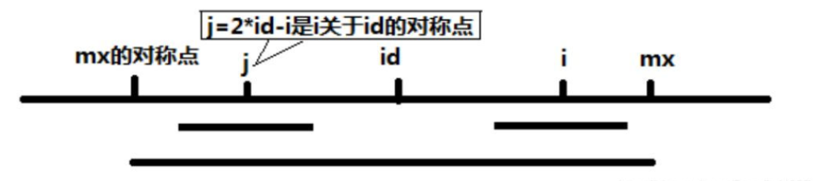
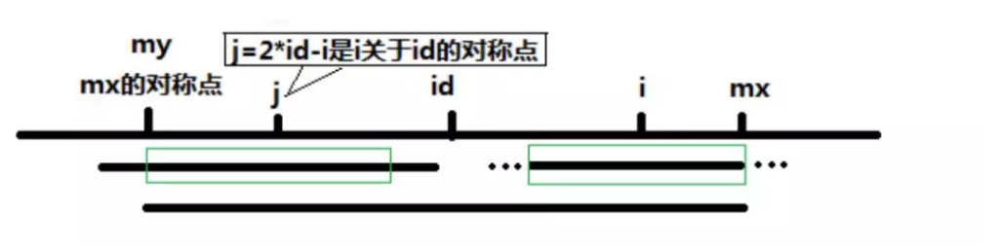

# Manacher算法
s = “12212321”
预处理：
变成奇数长度 s = "#1#2#2#1#2#3#2#1#"
在字符字符前后加上特殊字符防止越界 s = "$#1#2#2#1#2#3#2#1#"（C语言字符串结尾有特殊字符'\0'，所以只在最前面加特殊字符）

```cpp
\\ 预处理
string pre_process(string s) {
  
}
```
使用 p[i] 记录以字符 s[i] 为中心的最长回文子串向左/右扩展的长度（包括 s[i]，也就是把该回文串“对折”以后的长度）

```cpp
S  #  1  #  2  #  2  #  1  #  2  #  3  #  2  #  1  #
P  1  2  1  2  5  2  1  4  1  2  1  6  1  2  1  2  1
```
(p.s. 可以看出，P[i]-1正好是原字符串中回文串的总长度）

```cpp
\\ id 为已知的右边界最大（mx）的回文子串的中心， mx = id + p[id]
\\ 代表的回文串是 (id - p[i], id + p[id]) 长度为 2 * p[id] - 1
\\ i 为目前要计算的位置，j = 2 * id - i 是 i 关于 id 的对称点 
\\ j = id - (i - id) = 2 * id - i

\\ 当 i < mx 时 p[i] = min(p[j], mx - i) 如何理解 ？分开写成如下形式

if (p[j] < mx - i) 
  p[i] = p[j]
else // p[j] >= mx - i
  p[i] = mx - i;
```

当 mx - i > p[j] 的时候，以 s[j] 为中心的回文子串包含在以 s[id] 为中心的回文子串中，由于 i 和 j 对称，以 s[i] 为中心的回文子串必然包含在以 s[id]为中心的回文子串中，所以必有 p[i] = p[j]，见下图。

当 p[j] >= mx - i 的时候，以 s[j] 为中心的回文子串不一定完全包含于以 s[id] 为中心的回文子串中，但是基于对称性可知，下图中两个绿框所包围的部分是相同的，也就是说以S[i]为中心的回文子串，其向右至少会扩张到 mx 的位置，也就是说 p[i] >= mx - i。至于 mx 之后的部分是否对称，就只能老老实实去匹配了。


对于 mx <= i 的情况，无法对 p[i] 做更多的假设，只能 p[i] = 1，然后再去匹配了

```cpp
// 处理后得到字符串 s
int p[1000], id = 0, mx = 0; // 已知的最大的右边界（mx）对应的中心点 id
memset(p, 0, sizeof(p));

for (int i = 1; s[i]; i++) { 
  p[i] = i < mx ? min(p[2 * id - i], mx - i) : 1;
  while (s[i - p[i]] == s[i + p[i]]) p[i]++;
  if (i + p[i] > mx) { // 更新最右边界和中心点
    id = i;
    mx = i + p[i];
  }
  // 找出最大的 p[i]
}
```
# C++实现
// 求数组 p + 判断 s[i...j] 是否是回文串
```cpp
void Palindrome(string s) {
        string t = "$#";
        for (char c : s) t += string(1, c) + "#";
        t += "%";
        vector<int> p(t.size(), 0);
        int mid = 0, r = 0;
        for (int i = 1; i < t.size() - 1; i++) {
            p[i] = i < r ? min(r - i, p[2 * mid - i]) : 1;
            while (t[i - p[i]] == t[i + p[i]]) p[i]++;
            if (i + p[i] > r) {
                mid = i;
                r = i + p[i];
            }
        }
        
        // f(i, j) 判断 s[i...j] 是否是回文串 
        auto f = [&](int i, int j) {
            int m = (i + j) / 2; // [i, j] 的中心位置
            // s -> t 的下标对应是 m -> (m + 1) * 2
            // 如果区间 [i, j] 是偶数，则还要加 1
            int len = ((j - i + 1) % 2 == 1) ? p[2 * (m + 1)] - 1 : p[2 * (m + 1) + 1] - 1;
            return j - i + 1 <= len;
        };
}
```
# DP 求解

dp[i][j] 表示 字符串 s[i...j] 是否为回文串
```cpp
vector<vector<bool>> dp(n, vector<bool>(n, true));

for (int i = n - 2; i >= 0; i--)
  for (int j = i + 1; j < n; j++)
    dp[i][j] = s[i] == s[j] && dp[i + 1][j - 1];
```
