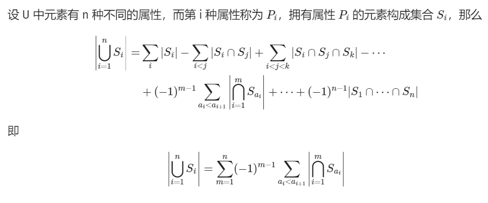
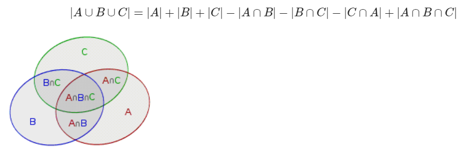
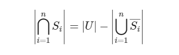

# 定义
https://oi-wiki.org/math/combinatorics/inclusion-exclusion-principle/



# 示例


# 补集
对于全集 U 下的集合的并可以使用容斥原理计算，而集合的交则用全集减去补集的并集求得，其中补集的并集则又可使用容斥原理计算：



# 练习
https://leetcode.cn/problems/kth-smallest-amount-with-single-denomination-combination/description/

利用二进制遍历集合
```cpp
class Solution {
public:
    long long findKthSmallest(vector<int>& coins, int k) {
        vector<long long> subset_lcm(1 << coins.size());
        subset_lcm[0] = 1;
        for (int i = 0; i < coins.size(); i++) {
            int bit = 1 << i;
            for (int mask = 0; mask < bit; mask++) {
                // 刷表法 DP，在集合 mask 的基础上添加元素 i
                subset_lcm[bit | mask] = lcm(subset_lcm[mask], coins[i]);
            }
        }

        auto check = [&](long long m) -> bool {
            long long cnt = 0;
            for (int i = 1; i < subset_lcm.size(); i++) { // 枚举所有非空子集
                cnt += __builtin_popcount(i) % 2 ? m / subset_lcm[i] : -m / subset_lcm[i];
            }
            return cnt >= k;
        };

        long long left = k - 1, right = (long long) ranges::min(coins) * k;
        while (left + 1 < right) {
            long long mid = (left + right) / 2;
            (check(mid) ? right : left) = mid;
        }
        return right;
    }
};
```