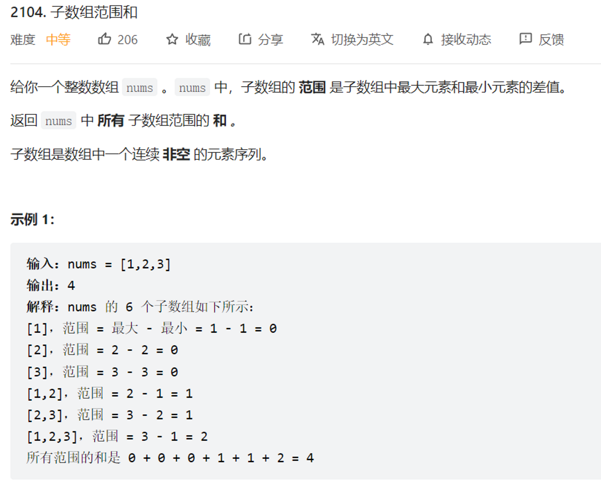

# 利用单调栈求最大值、最小值向左向右能扩展的范围
https://leetcode.cn/problems/sum-of-subarray-ranges/description/



# 思路
求出以每个数为最小值向左向右能达到的地方，保存在 L1、R1 数组中
求出以每个数为最大值向左向右能达到的地方，保存在 L2、R2 数组中
结果等于每个子数组的最大值减去最小值之和，等价于所有子数组的最大值之和与所有子
数组的最小值之和的差
以nums[i]为最小值的范围为[ L1[i], R1[i] ]，那么以nums[i]为最小值的区间个数为(R[i]-i + 1) * (i-L[i]+1)，据此便能得到最后的结果。

# 如何处理一个区间的最值不唯一的问题
如果 nums[i] == nums[j] 且 i < j, 则我们假设在逻辑上 nums[i] < nums[j]，即如果区间内有多个最值，我们使用最后一个最值作为区间的最值。
求最小值的作用范围时维护一个单调递增的栈，求最大值的作用范围时维护一个单调递减的栈。

```cpp
class Solution {
public:
    long long subArrayRanges(vector<int>& nums) {
        int MIN = -1e9 - 1;
        int MAX = -MIN;
        int n = nums.size();
        vector<int> L1(n + 1), R1(n + 1);
        vector<int> L2(n + 1), R2(n + 1);
        stack<int> s;
        nums.push_back(MIN);
        for (int i = 0; i < n + 1; i++) {
            L1[i] = i;
            while (!s.empty() && nums[s.top()] >= nums[i]) {
                L1[i] = min(L1[i], L1[s.top()]);
                R1[s.top()] = i - 1;
                s.pop();
            }
            s.push(i);
        }
        nums.pop_back();
        
        nums.push_back(MAX);
        s.pop();
        for (int i = 0; i < n + 1; i++) {
            L2[i] = i;
            while (!s.empty() && nums[s.top()] <= nums[i]) {
                L2[i] = min(L2[i], L2[s.top()]);
                R2[s.top()] = i - 1;
                s.pop();
            }
            s.push(i);
        }
        nums.pop_back();
        
        typedef long long ll;
        ll ans = 0;
        for (int i = 0; i < n; i++) {
            ans -= (ll)(nums[i]) * (R1[i] - i + 1) * (i - L1[i] + 1);
            ans += (ll)(nums[i]) * (R2[i] - i + 1) * (i - L2[i] + 1);
        }
        return ans;
    }
}; 
```