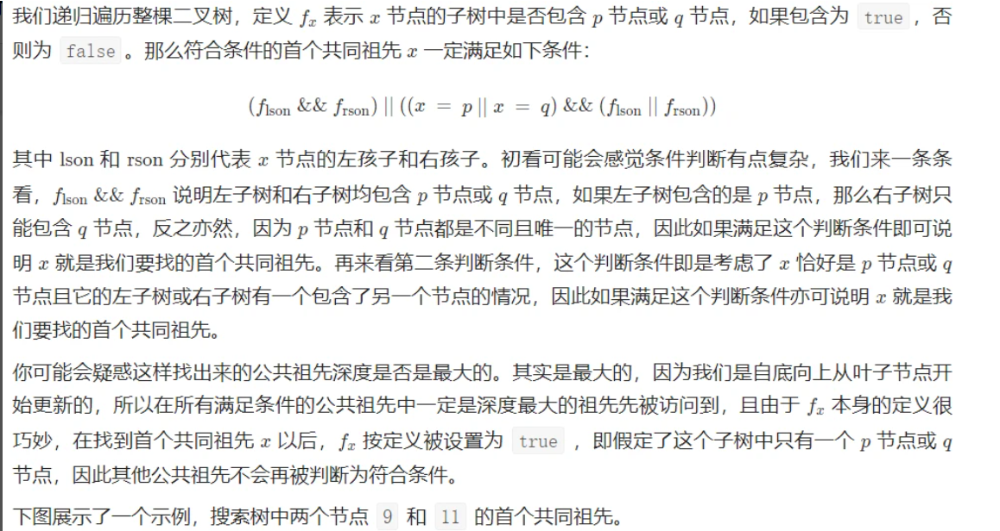

# 二叉树最近公共祖先
https://leetcode.cn/problems/lowest-common-ancestor-of-a-binary-tree/description/

```cpp
class Solution {
public:
    TreeNode* lowestCommonAncestor(TreeNode* root, TreeNode* p, TreeNode* q) {
        if (root == nullptr || root == p || root == q) return root;
        TreeNode *left = lowestCommonAncestor(root->left, p, q);
        TreeNode *right = lowestCommonAncestor(root->right, p, q);
        if (left && right)
            return root;
        else if (left)
            return left;
        else
            return right;
    }
};
```
# 暴力算法
```cpp
#include <iostream>
#include <vector>
​
using namespace std;
​
const int N = 10001;
vector<int> g[N]; // 邻接表
int d[N], f[N]; // 各个节点的深度和父节点编号
​
// dfs 求出各个节点的深度和父节点
// 此处一个注意点是，在主函数中调用形式如下 dfs(root, root), d[root] 可在主函数中初始化 0
void dfs(int rt, int fa) {
    d[rt] = d[fa] + 1; // 当前节点的父节点是 fa ，深度是父节点深度加 1
    f[rt] = fa;
    for (int c : g[rt]) {
        if (c == fa) continue;
        dfs(c, rt);
    }
} 
​
// 求节点 a 和 b 的最近公共祖先
int lca(int a, int b) {
    if (d[a] > d[b]) swap(a, b); // 使 d[a] <= d[b]
    while (d[a] < d[b]) b = f[b]; // 上调 d 直到 d[a] = d[b]
    while (a != b) a = f[a], b = f[b]; // 同时上调 a, b 直到 a = b
    return a;
}
```
# 倍增算法
暴力法中，每次上调的步数都是 1，效率不高
```cpp
#include <iostream>
#include <vector>
​
using namespace std;
​
const int N = 10001;
vector<int> g[N]; // 邻接表
int d[N], f[N][20]; // f[i][j]：从 i 向上走 2 ^ j 步到达的父节点编号 
​
​// 注意点:初始化时，f[root][i]均等于root可在dfs中初始化，或者在调用时初始化
void dfs(int rt, int fa) {
    d[rt] = d[fa] + 1;
    f[rt][0] = fa; // rt上调一步到达fa
    for (int i = 1; i < 20; i++)
        f[rt][i] = f[f[rt][i - 1]][i - 1];
    for (int c : g[rt]) {
        if (c == fa) continue;
        dfs(c, rt);
    }
}
​
int lca(int a, int b) {
    if (d[a] > d[b]) swap(a, b); // 保证 d[a] <= d[b]
    for (int i = 19; i >= 0; i--) // 保证 a 和 b 的高度一致
        if (d[a] <= d[f[b][i]])
            b = f[b][i];
    if (a == b) return a; // 注意，需要先判断，如果相等了则直接返回
    
    for (int i = 19; i >= 0; i--) // 调整步长从大到小
        if (f[a][i] != f[b][i]) // 如果 f[a][i] 和 f[b][i] 不同，说明两者还需要向上调整
            a = f[a][i], b = f[b][i];
    return f[b][0]; // 需要留意最后的结果是 f[a][0], f[b][0]
}
```