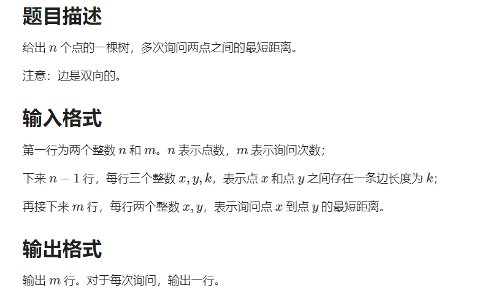

# 一维前缀和
前缀和可以简单理解为数列的前n项的和，是一种重要的预处理方式，能大大降低查询的时间复杂度。

# 二维前缀和
多维前缀和的普通求解方法几乎都是基于容斥原理。

```cpp
// 二维前缀和矩阵公式，下标从1开始 a：原数组，s：前缀和数组
s[i][j] = s[i - 1][j] + s[i][j - 1] - s[i - 1][j - 1] + a[i][j]

// 计算（x1，y1）和（x2，y2）对应的子矩阵的和，下标从1开始 a：原数组，s：前缀和数组
s[x2][y2] - s[x1 - 1][y1] - s[x1][y1 - 1] + s[x1 - 1][y1 - 1]
```
# 树上前缀和
设`sum[i]`表示节点`i`到根节点的权值总和。
- 若是点权，`x`和`y`路径上的和为`sum[x] + sum[y] - sum[lca] - sum[f_lca]`，其中`lca`表示节点`x`和`y`的最近公共祖先，`f_lca`表示最近公共祖先的父节点。
- 若是边权，`x`和`y`路径上的和为`sum[x] + sum[y] - 2 * sum[lca]`，其中`lca`表示节点`x`和`y`的最近公共祖先。

## 例题（点权）
2491. 「BJOI2018」求和

https://loj.ac/p/2491

```cpp
#include <bits/stdc++.h>

using namespace std;

const int M = 20;
const int N = 3e5 + 10;
const int K = 52;
const int MOD = 998244353;
using ll = long long;

vector<int> g[N];
vector<int> d(N, 0);
vector<vector<int>> f(N, vector<int>(M, 0));
vector<vector<int>> sum(N, vector<int>(K, 0));

void dfs(int rt, int fa)
{
    d[rt] = d[fa] + 1;
    ll val = d[rt];
    for (int i = 1; i < K; i++) {
        sum[rt][i] = ((ll)sum[fa][i] + val) % MOD;
        val = val * d[rt] % MOD;
    }
    f[rt][0] = fa;
    for (int i = 1; i < M; i++) f[rt][i] = f[f[rt][i - 1]][i - 1];
    for (int c : g[rt]) {
        if (fa == c) continue;
        dfs(c, rt);
    }
}

int lca(int a, int b)
{
    if (d[a] > d[b]) swap(a, b);
    for (int i = M - 1; i >= 0; i--) {
        if (d[a] <= d[f[b][i]]) {
            b = f[b][i];
        }
    }
    if (a == b) return a;

    for (int i = M - 1; i >= 0; i--) {
        if (f[a][i] != f[b][i]) {
            a = f[a][i];
            b = f[b][i];
        }
    }
    return f[a][0];
}

int main()
{
    int n, a, b, m, k;
    scanf("%d", &n);
    for (int i = 1; i < n; i++) {
        scanf("%d %d", &a, &b);
        g[a].push_back(b);
        g[b].push_back(a);
    }
    d[1] = -1; // 根节点1的深度为0
    dfs(1, 1);
    scanf("%d", &m);
    while (m--) {
        scanf("%d %d %d", &a, &b, &k);
        int c = lca(a, b);
        ll val = ((ll)sum[a][k] + sum[b][k] - sum[c][k] - (c == 1 ? 0 : sum[f[c][0]][k])) % MOD;
        val = (val + MOD) % MOD;
        printf("%lld\n", val);
    }
    return 0;
}
```
## 例题（边权）
LOJ 10134.Dis

https://loj.ac/p/10134



```cpp
#include <bits/stdc++.h>

using namespace std;

const int M = 20;
const int N = 1e4 + 10;

vector<pair<int, int>> g[N];
vector<int> d(N, 0);
vector<vector<int>> f(N, vector<int>(M, 0));
vector<int> sum(N);

void dfs(int rt, int fa)
{
    d[rt] = d[fa] + 1;
    f[rt][0] = fa;
    for (int i = 1; i < M; i++) f[rt][i] = f[f[rt][i - 1]][i - 1];
    for (auto [c, k] : g[rt]) {
        if (fa == c) continue;
        sum[c] = sum[rt] + k;
        dfs(c, rt);
    }
}

int lca(int a, int b)
{
    if (d[a] > d[b]) swap(a, b);
    for (int i = M - 1; i >= 0; i--) {
        if (d[a] <= d[f[b][i]]) {
            b = f[b][i];
        }
    }
    if (a == b) return a;

    for (int i = M - 1; i >= 0; i--) {
        if (f[a][i] != f[b][i]) {
            a = f[a][i];
            b = f[b][i];
        }
    }
    return f[a][0];
}

int main()
{
    int n, a, b, m, k;
    scanf("%d %d", &n, &m);
    for (int i = 1; i < n; i++) {
        scanf("%d %d %d", &a, &b, &k);
        g[a].emplace_back(b, k);
        g[b].emplace_back(a, k);
    }
    d[1] = -1; // 根节点1的深度为0
    dfs(1, 1);
    while (m--) {
        scanf("%d %d", &a, &b);
        int c = lca(a, b);
        printf("%d\n", sum[a] + sum[b] - 2 * sum[c]);
    }
    return 0;
}
```