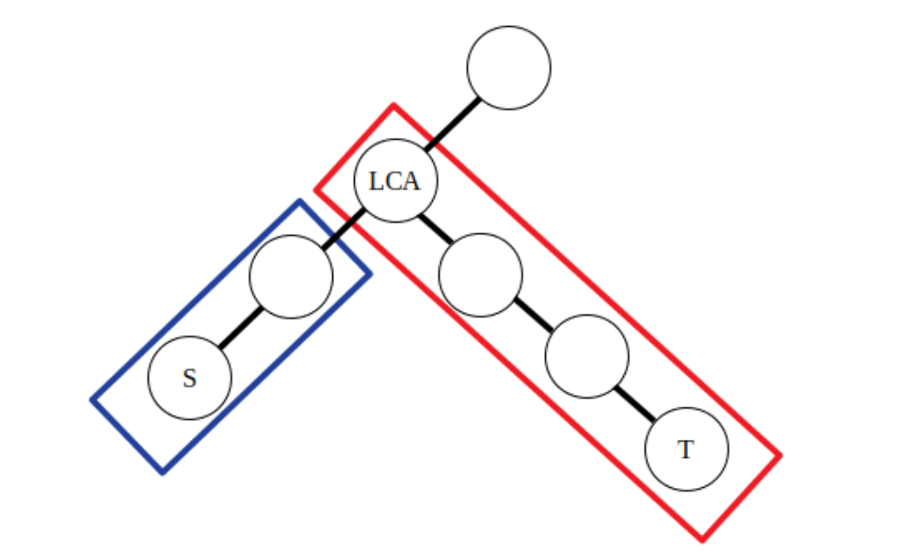
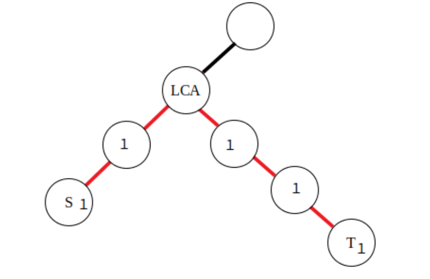

# 一维差分
对一维数组某个区间进行某类操作（例如区间内每个元素加上某个数），最后查询元素修改后的值。

# 二维差分
对二维数组的某个子矩阵进行某类操作（例如矩阵内每个元素都加上某个数），最后查询元素修改后的值。
## 计算二维差分数组
根据原数组`a[][]`计算差分数组`d[][]`，`a[i][j]`是差分数组`d[][]`的二维前缀和，因此，`d[i][j]`可通过如下公式获取：
```cpp
a[i][j] = d[i][j] + a[i - 1][j] + a[i][j - 1] - a[i - 1][j - 1];
d[i][j] = a[i][j] - a[i - 1][j] - a[i][j - 1] + a[i - 1][j - 1];
```
## 子矩阵修改转化为差分数组操作
左上角：[x1, y1], 右下角：[x2, y2]
```cpp
d[x1][y1]: +1
d[x2 + 1][y2 + 1]: +1
d[x1][y2 + 1]: -1
d[x2 + 1][y1]: -1
```
## 例题
题目：2536. 子矩阵元素加 1

https://leetcode.cn/problems/increment-submatrices-by-one/description/
```cpp
class Solution {
public:
    vector<vector<int>> rangeAddQueries(int n, vector<vector<int>>& q) {
        vector<vector<int>> g(n + 10, vector<int>(n + 10, 0));
        vector<vector<int>> ans(n, vector<int>(n));
        
        auto add = [&](int x1, int y1, int x2, int y2, int num) {
            g[x2+1][y2+1] += num;
            g[x1][y1] += num;
            g[x1][y2 + 1] -= num;
            g[x2 + 1][y1] -= num;
        };
        
        for (auto& v : q) add(v[0] + 1, v[1] + 1, v[2] + 1, v[3] + 1, 1);
        
        for(int i = 1 ; i<= n ; i++)
            for(int j = 1; j <= n ;j++) {
                g[i][j] += g[i][j-1] + g[i-1][j] - g[i-1][j-1];
                ans[i - 1][j - 1] = g[i][j];
            }
        return ans;
    }
};
```


# 树上差分
树上差分可以理解为对树上的某一段路径进行差分操作，这里的路径可以类比一维数组的区间进行理解。例如在对树上的一些路径进行频繁操作，并且询问某条边或者某个点在经过操作后的值的时候，就可以运用树上差分思想了。

设原权值为`a[]`，差分值为`d[]`，其中`d[i]`是以`i`为子树的权值的差分，根据`a[]`是点权还是边权，树上差分可分为点差分与边差分。
## 点差分
对树上的一些路径进行访问，[s1, t1], [s2, t2], [s3, t3]...，问某些点访问的次数。处理对路径[s, t]的访问时，差分数组的修改如下：
```cpp
// lca是s、t的最近公共祖先，f_lca是lca的父节点。
d[s]: +1
d[t]: +1
d[lca]: -1
d[f_lca]: -1
```


## 边差分
对树上的一些路径进行访问，[s1, t1], [s2, t2], [s3, t3]...，问某些边访问的次数。处理对路径[s, t]的访问时，差分数组的修改如下：
```cpp
// lca是s、t的最近公共祖先，f_lca是lca的父节点。
d[s]: +1
d[t]: +1
d[lca]: -2
```

